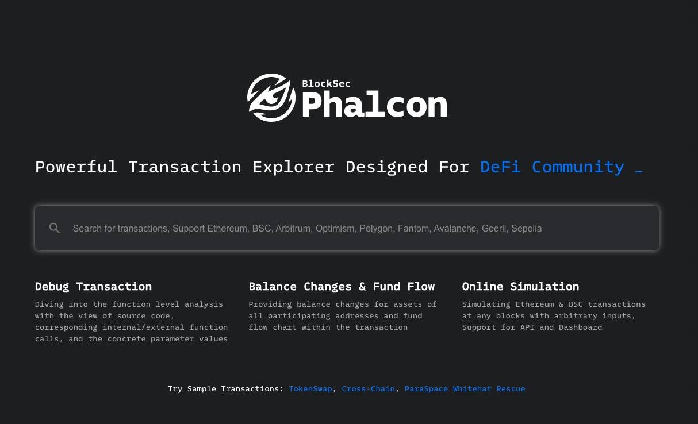
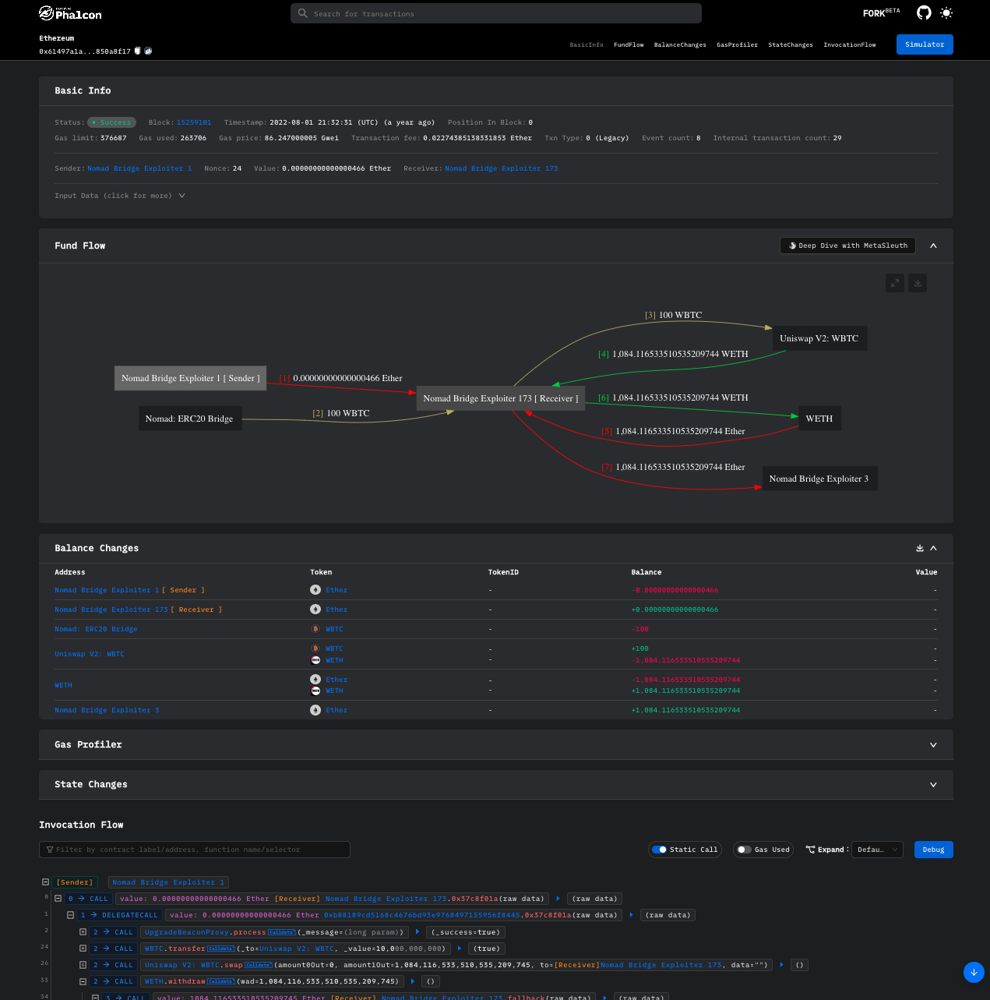
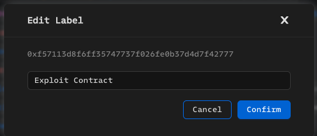
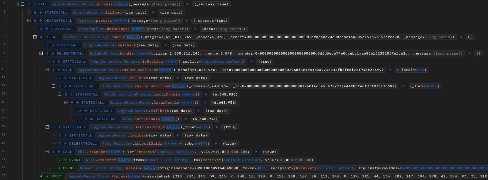
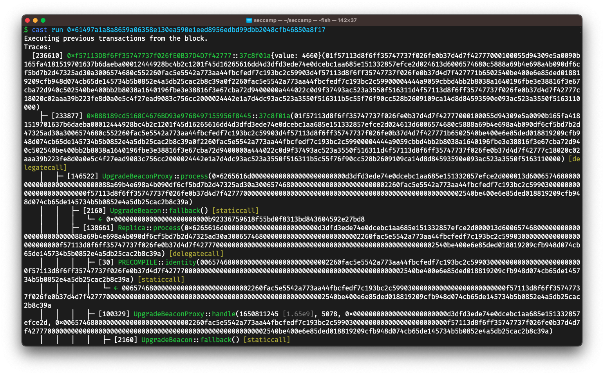
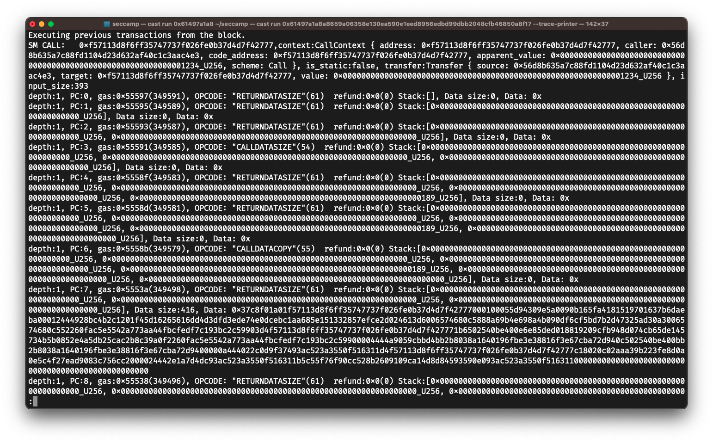
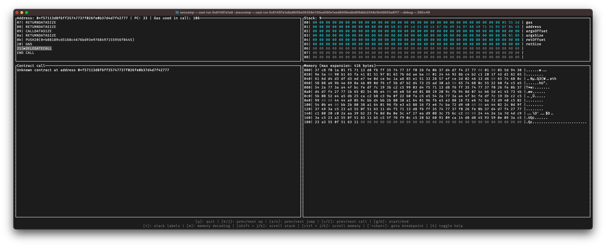
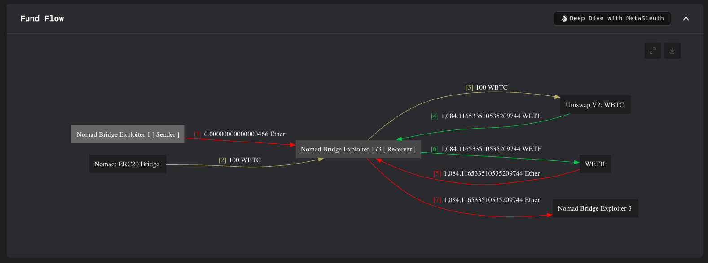
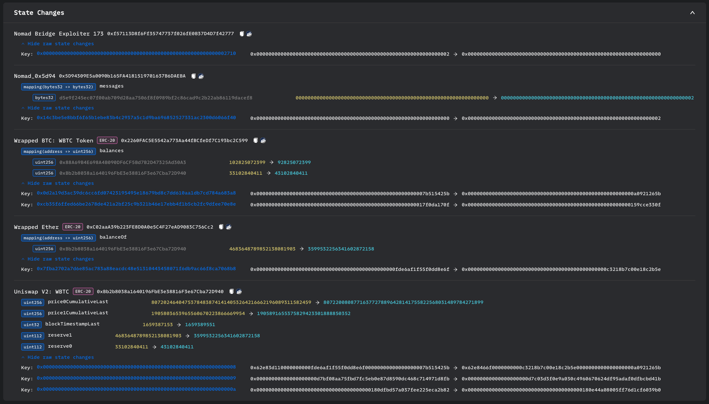

# On-Chain Investigations of Attacks

攻撃トランザクションを調査・解析する手法について解説します。

**目次**
- [トランザクションのトレーシング](#トランザクションのトレーシング)
  - [高度なトランザクションエクスプローラー](#高度なトランザクションエクスプローラー)
  - [トランザクションのトレーシングとは](#トランザクションのトレーシングとは)
- [Phalconによるトランザクションの解析](#phalconによるトランザクションの解析)
  - [Phalconとは](#phalconとは)
  - [トランザクションのサーチ](#トランザクションのサーチ)
  - [トランザクション分析画面](#トランザクション分析画面)
  - [Invocation Flowとは](#invocation-flowとは)
  - [攻撃の全体把握と攻撃種類の特定](#攻撃の全体把握と攻撃種類の特定)
  - [被害を受けたコントラクトの調査](#被害を受けたコントラクトの調査)
- [Forgeによるトランザクションの解析](#forgeによるトランザクションの解析)
  - [攻撃直前のストレージ調査](#攻撃直前のストレージ調査)
  - [脆弱性の特定](#脆弱性の特定)
- [Castによるトランザクションの解析](#castによるトランザクションの解析)
  - [Castとは](#castとは)
  - [`cast run <TX_HASH>`](#cast-run-tx_hash)
  - [`cast run <TX_HASH> --trace-printer`](#cast-run-tx_hash---trace-printer)
  - [`cast run <TX_HASH> --debug`](#cast-run-tx_hash---debug)
- [補足: Phalconのその他の機能](#補足-phalconのその他の機能)
  - [Basic Info](#basic-info)
  - [Fund Flow](#fund-flow)
  - [Balance Changes](#balance-changes)
  - [Gas Profiler](#gas-profiler)
  - [State Changes](#state-changes)

## トランザクションのトレーシング

### 高度なトランザクションエクスプローラー

トランザクションは[Etherscan](https://etherscan.io/)のようなトランザクションエクスプローラーで閲覧されることが多いです。
一般的な用途にはEtherscanでも十分ですが、攻撃トランザクションを解析するには不十分です。
そのため、コントラクト開発者やセキュリティリサーチャーを対象にした、高機能なトランザクションエクスプローラーが開発されています。

例えば、以下のトランザクションエクスプローラーが有名です。
- [Blocksec Phalcon](https://explorer.phalcon.xyz/)
- [Tenderly Explorer](https://dashboard.tenderly.co/explorer)
- [Dedaub Contract Library](https://library.dedaub.com/)

### トランザクションのトレーシングとは

攻撃を調査・解析・再現するためには、トランザクションをトレースする必要があります。

トランザクションのトレーシングとは、そのトランザクションがどのような処理を実行したかを追跡することです。
より具体的には、トランザクション実行前の時点のステートを取得して、ローカルで実際にトランザクションを実行して、「どのようなアドレスに」「どのようなコールを実行して」「どのようなイベントが発生したか」などのプロセスをツールが出力することを指します。
トレーシングは、攻撃の調査だけでなく予期せず失敗したトランザクション調査などにも使われます。

上記で紹介したトランザクションエクスプローラーは全てトレーシング機能がついており、トランザクショントレーサーと呼ばれることもあります。

このゼミでは、トランザクショントレーサーとして主にPhalconを利用します。
また、補助のトレーサーとして、FoundryのCastのトレーシング機能を使います。
どちらも詳しく紹介します。

## Phalconによるトランザクションの解析

### Phalconとは

Phalconは、Blocksecが開発しているトランザクションエクスプローラーです。
https://explorer.phalcon.xyz/ から利用できます。
アクセスすると次のような画面が表示されます（2023-08-02時点）。



### トランザクションのサーチ

実際にトランザクションの分析をしてみましょう。
例として、2022-08-01に起きたNomad Bridgeの攻撃トランザクションの一つ（`0x61497a1a8a8659a06358e130ea590e1eed8956edbd99dbb2048cfb46850a8f17`）を追っていくことにします。

Nomad Bridgeについては詳しくは説明しませんが、クロスチェーンのブリッジです。
Optimistic RollupのようにOptimisticな検証メカニズムを使用して、ブリッジを実現しています。
しかし、この攻撃により全体で約1億9000万ドルの資金がコントラクトから流出しました。

この攻撃トランザクションは100 WBTCを奪取しています。
**ここではあえて、この攻撃トランザクションについて100 WBTCを奪取したという情報以外を一切わからない状態で解析するプロセスを説明したいと思います。**

上記画面のサーチボックスに攻撃トランザクションのハッシュである `0x61497a1a8a8659a06358e130ea590e1eed8956edbd99dbb2048cfb46850a8f17` を入力してみてください。
次のような画面になると思います。


PhalconはEthereumメインネット以外にもいくつか対応しており、どのチェーンのトランザクションかを内部で判別して、候補を自動的に表示してくれます。
今回はEthereumメインネットでの攻撃なので、Ethereumメインネットのトランザクションが表示されています。

### トランザクション分析画面

候補に出てきたトランザクションをクリックしてください。
https://explorer.phalcon.xyz/tx/eth/0x61497a1a8a8659a06358e130ea590e1eed8956edbd99dbb2048cfb46850a8f17 に遷移して、全体的に次のような画面になります。



様々な情報が表示されています。

最後のInvocation Flowを見てください。
これがトレーシング結果になっています。
このInvocation Flowを利用して、攻撃の調査を行っていきます。

Fund FlowやBalance Changesなどについては、最後の補足で解説しています。

### Invocation Flowとは

Invocation Flowとは、その名の通りコールとイベントのフローのことです。
次のような画面になっています。


パッと見て、`Sender`である`Nomad Bridge Exploiter 1`が送信したトランザクションの内部の処理が表示されていることがわかると思います。
トレーシングとは言いましたが、コールとイベントという重要な情報に限って表示されており、内部の細かな処理は見れません。

ただ、攻撃の概要把握や実装においては、基本的にこれだけの情報で十分です。
これより細かな処理をトレースしたい場合は、後述するCastなどを使います。

ここでは重要な機能だけ必要に応じて解説していきます。

### 攻撃の全体把握と攻撃種類の特定

まず、右上にあるExpandが`Default`になっています。
このExpandはコールの深さを指定できます。


このExpandを`0`にしてみましょう。


情報が少なくなりました。

ここから、`Sender`である`Nomad Bridge Exploiter 1`が送信したトランザクションは、`Receiver`と表示されている`Nomad Bridge Exploiter 173`の関数`0x37c8f01a`を呼び出していることがわかります。
0.00000000000000466 Etherも送信しています。
要は、`Nomad Bridge Exploiter 1`が既にデプロイした攻撃コントラクトの関数`0x37c8f01a`を呼び出したということです。

`Nomad Bridge Exploiter 1`はラベルであり、ホバーすると本来のアドレスが表示されます。


既にコミュニティによってラベルがつけられているアドレスは、このように自動でラベルがつけられます。
ペンボタンを押せば、自身でこのラベルを変更することもできますし、まだラベルがつけられていないアドレスにラベルをつけることも可能です（ペンボタンから+ボタンに変わります）。
実際に`Nomad Bridge Exploiter 173`を`Exploit Contract`に変更してみてください。



ちなみに`0x37c8f01a`は関数セレクタですが、この関数の関数セレクタと関数シグネチャのペアがパブリックなデータベースに登録されていないため、関数シグネチャがわかりません。

```sh
$ cast 4 0x37c8f01a
Error: 
Could not decode response:
 {"ok":true,"result":{"event":{},"function":{"0x37c8f01a":null}}}
.
Error: invalid type: null, expected a sequence at line 1 column 61
```

これも関数シグネチャがわかれば、自動でラベルがつけられます

コールデータやリターンデータもホバーすれば詳細が表示されます。


さて、それではコールの深さを増やしてみます。
Expandを`1`にしてみてください。


情報が1行増えました。
このように必要に応じてコールの深さを変更すると調査がやりやすくなります。

`Exploit Contract`の関数`0x37c8f01a`の内部で、`DELEGATECALL`で`0xb88189cd5168c4676bd93e9768497155956f8445`の関数`0x37c8f01a`を呼び出しています。
関数セレクタが同じですし、実際の攻撃処理が`0xb88189cd5168c4676bd93e9768497155956f8445`にありそうだとわかります（なぜ`Exploit Contract`に実装しなかったかは謎です）。
`0xb88189cd5168c4676bd93e9768497155956f8445`を`Exploit Impl Contract`と呼ぶことにし、ラベルもつけておきます。

では、Expandを`2`にしてみましょう。


5つのコールが追加で表示されました。

まず、次のことがすぐにわかります。
- 2,3つ目のコール: Uniswap V2を使って100 WBTCをWETHへスワップ
- 4つ目のコール: WETHをEtherに変換
- 5つ目のコール: Etherを攻撃者の別のアドレスに送金する処理

ということは、1つ目の`UpgradeBeaconProxy`とラベルがつけられたアドレスへのコールが攻撃処理で、不正に100 WBTCを取得したのだろうと推測できます。
実際、ラベルがつけられているアドレス`0x5d94309e5a0090b165fa4181519701637b6daeba`はNomad Bridgeのプロキシコントラクトです。

1つ目のコールが本質だとわかりましたし、そろそろ慣れてきたと思うので、一旦全てのコールとイベントを軽く見てみましょう。
Expandを`All`にしてみてください。
コールの左にある+ボタンで開いても構いません。



なぜ一旦全ての処理を見てみたかというと、Reentrancy Attackの場合、ここに表示されているコールの中に`Receiver`である`Exploit Contract`へのコールが一つ以上あるはずであり、それが存在するかを確認したかったからです。
今回のケースはどうかというと、そのようなコールは見当たりません。
つまり、Reentrancy Attackではありません。

ということは、攻撃は実質この1つ目のコールだけで完結しているということです。
`UpgradeBeaconProxy`に対して`process`関数を特定のコールデータで呼び出すだけです。

実際この攻撃は単一のトランザクションであり、`Exploit Contract`をデプロイする以外の他のトランザクションはありません。
よって、処理の複雑さという点ではかなりシンプルな攻撃だということがわかります。

この事実は攻撃の再現だけを行うという点では若干重要です。
なぜなら、攻撃コントラクトを書くときに、コールの深さが3以下は無視できるからです。
（当然、なぜその攻撃が実現出来たかを理解するためには、コールの深さが3以下の処理も見る必要はあります。）

ちなみに、このテクニックはReentrancy Attackの場合でも同様に使えます。
Reentrancy Attackの場合は`Receiver`コントラクトの処理だけ追えば良いのです。

また、実際の送金が起こる（今回は100 WBTCの送金）までのコールスタックを見ることも攻撃の理解に繋がります。
以下では、`STATICCALL`の表示をオフにしたり、`ensureLocalToken`を閉じたりして、なるべく重要ではない情報を省きました。


### 被害を受けたコントラクトの調査

では、`UpgradeBeaconProxy`（`0x5d94309e5a0090b165fa4181519701637b6daeba`）とはなんなのでしょうか？

`UpgradeBeaconProxy`にホバーすると右下にEtherscanボタンが出てくるので、Etherscanでコントラクトのコードを見てみます。


以下のコードが得られます。

<details>
<summary>UpgradeBeaconProxyのコード</summary>

```solidity
// SPDX-License-Identifier: MIT
pragma solidity >=0.6.11;

// ============ External Imports ============
import {Address} from "@openzeppelin/contracts/utils/Address.sol";

/**
 * @title UpgradeBeaconProxy
 * @notice
 * Proxy contract which delegates all logic, including initialization,
 * to an implementation contract.
 * The implementation contract is stored within an Upgrade Beacon contract;
 * the implementation contract can be changed by performing an upgrade on the Upgrade Beacon contract.
 * The Upgrade Beacon contract for this Proxy is immutably specified at deployment.
 * @dev This implementation combines the gas savings of keeping the UpgradeBeacon address outside of contract storage
 * found in 0age's implementation:
 * https://github.com/dharma-eng/dharma-smart-wallet/blob/master/contracts/proxies/smart-wallet/UpgradeBeaconProxyV1.sol
 * With the added safety checks that the UpgradeBeacon and implementation are contracts at time of deployment
 * found in OpenZeppelin's implementation:
 * https://github.com/OpenZeppelin/openzeppelin-contracts/blob/master/contracts/proxy/beacon/BeaconProxy.sol
 */
contract UpgradeBeaconProxy {
    // ============ Immutables ============

    // Upgrade Beacon address is immutable (therefore not kept in contract storage)
    address private immutable upgradeBeacon;

    // ============ Constructor ============

    /**
     * @notice Validate that the Upgrade Beacon is a contract, then set its
     * address immutably within this contract.
     * Validate that the implementation is also a contract,
     * Then call the initialization function defined at the implementation.
     * The deployment will revert and pass along the
     * revert reason if the initialization function reverts.
     * @param _upgradeBeacon Address of the Upgrade Beacon to be stored immutably in the contract
     * @param _initializationCalldata Calldata supplied when calling the initialization function
     */
    constructor(address _upgradeBeacon, bytes memory _initializationCalldata)
        payable
    {
        // Validate the Upgrade Beacon is a contract
        require(Address.isContract(_upgradeBeacon), "beacon !contract");
        // set the Upgrade Beacon
        upgradeBeacon = _upgradeBeacon;
        // Validate the implementation is a contract
        address _implementation = _getImplementation(_upgradeBeacon);
        require(
            Address.isContract(_implementation),
            "beacon implementation !contract"
        );
        // Call the initialization function on the implementation
        if (_initializationCalldata.length > 0) {
            _initialize(_implementation, _initializationCalldata);
        }
    }

    // ============ External Functions ============

    /**
     * @notice Forwards all calls with data to _fallback()
     * No public functions are declared on the contract, so all calls hit fallback
     */
    fallback() external payable {
        _fallback();
    }

    /**
     * @notice Forwards all calls with no data to _fallback()
     */
    receive() external payable {
        _fallback();
    }

    // ============ Private Functions ============

    /**
     * @notice Call the initialization function on the implementation
     * Used at deployment to initialize the proxy
     * based on the logic for initialization defined at the implementation
     * @param _implementation - Contract to which the initalization is delegated
     * @param _initializationCalldata - Calldata supplied when calling the initialization function
     */
    function _initialize(
        address _implementation,
        bytes memory _initializationCalldata
    ) private {
        // Delegatecall into the implementation, supplying initialization calldata.
        (bool _ok, ) = _implementation.delegatecall(_initializationCalldata);
        // Revert and include revert data if delegatecall to implementation reverts.
        if (!_ok) {
            assembly {
                returndatacopy(0, 0, returndatasize())
                revert(0, returndatasize())
            }
        }
    }

    /**
     * @notice Delegates function calls to the implementation contract returned by the Upgrade Beacon
     */
    function _fallback() private {
        _delegate(_getImplementation());
    }

    /**
     * @notice Delegate function execution to the implementation contract
     * @dev This is a low level function that doesn't return to its internal
     * call site. It will return whatever is returned by the implementation to the
     * external caller, reverting and returning the revert data if implementation
     * reverts.
     * @param _implementation - Address to which the function execution is delegated
     */
    function _delegate(address _implementation) private {
        assembly {
            // Copy msg.data. We take full control of memory in this inline assembly
            // block because it will not return to Solidity code. We overwrite the
            // Solidity scratch pad at memory position 0.
            calldatacopy(0, 0, calldatasize())
            // Delegatecall to the implementation, supplying calldata and gas.
            // Out and outsize are set to zero - instead, use the return buffer.
            let result := delegatecall(
                gas(),
                _implementation,
                0,
                calldatasize(),
                0,
                0
            )
            // Copy the returned data from the return buffer.
            returndatacopy(0, 0, returndatasize())
            switch result
            // Delegatecall returns 0 on error.
            case 0 {
                revert(0, returndatasize())
            }
            default {
                return(0, returndatasize())
            }
        }
    }

    /**
     * @notice Call the Upgrade Beacon to get the current implementation contract address
     * @return _implementation Address of the current implementation.
     */
    function _getImplementation()
        private
        view
        returns (address _implementation)
    {
        _implementation = _getImplementation(upgradeBeacon);
    }

    /**
     * @notice Call the Upgrade Beacon to get the current implementation contract address
     * @dev _upgradeBeacon is passed as a parameter so that
     * we can also use this function in the constructor,
     * where we can't access immutable variables.
     * @param _upgradeBeacon Address of the UpgradeBeacon storing the current implementation
     * @return _implementation Address of the current implementation.
     */
    function _getImplementation(address _upgradeBeacon)
        private
        view
        returns (address _implementation)
    {
        // Get the current implementation address from the upgrade beacon.
        (bool _ok, bytes memory _returnData) = _upgradeBeacon.staticcall("");
        // Revert and pass along revert message if call to upgrade beacon reverts.
        require(_ok, string(_returnData));
        // Set the implementation to the address returned from the upgrade beacon.
        _implementation = abi.decode(_returnData, (address));
    }
}
```

</details>

`UpgradeBeaconProxy`は、いわゆるアップグレードを可能にするために導入されたコントラクトです。
`UpgradeBeaconProxy`では、以下の処理が行われています。


`UpgradeBeacon`は、現在のロジックコントラクトのアドレスを返すコントラクトです。
このコントラクトが指すロジックコントラクトのアドレスを変更することで、擬似的なアップグレードを実現しています。
コードは以下です。

<details>
<summary>UpgradeBeaconのコード</summary>

```solidity
// SPDX-License-Identifier: MIT
pragma solidity >=0.6.11;

// ============ External Imports ============
import {Address} from "@openzeppelin/contracts/utils/Address.sol";

/**
 * @title UpgradeBeacon
 * @notice Stores the address of an implementation contract
 * and allows a controller to upgrade the implementation address
 * @dev This implementation combines the gas savings of having no function selectors
 * found in 0age's implementation:
 * https://github.com/dharma-eng/dharma-smart-wallet/blob/master/contracts/proxies/smart-wallet/UpgradeBeaconProxyV1.sol
 * With the added niceties of a safety check that each implementation is a contract
 * and an Upgrade event emitted each time the implementation is changed
 * found in OpenZeppelin's implementation:
 * https://github.com/OpenZeppelin/openzeppelin-contracts/blob/master/contracts/proxy/beacon/BeaconProxy.sol
 */
contract UpgradeBeacon {
    // ============ Immutables ============

    // The controller is capable of modifying the implementation address
    address private immutable controller;

    // ============ Private Storage Variables ============

    // The implementation address is held in storage slot zero.
    address private implementation;

    // ============ Events ============

    // Upgrade event is emitted each time the implementation address is set
    // (including deployment)
    event Upgrade(address indexed implementation);

    // ============ Constructor ============

    /**
     * @notice Validate the initial implementation and store it.
     * Store the controller immutably.
     * @param _initialImplementation Address of the initial implementation contract
     * @param _controller Address of the controller who can upgrade the implementation
     */
    constructor(address _initialImplementation, address _controller) payable {
        _setImplementation(_initialImplementation);
        controller = _controller;
    }

    // ============ External Functions ============

    /**
     * @notice For all callers except the controller, return the current implementation address.
     * If called by the Controller, update the implementation address
     * to the address passed in the calldata.
     * Note: this requires inline assembly because Solidity fallback functions
     * do not natively take arguments or return values.
     */
    fallback() external payable {
        if (msg.sender != controller) {
            // if not called by the controller,
            // load implementation address from storage slot zero
            // and return it.
            assembly {
                mstore(0, sload(0))
                return(0, 32)
            }
        } else {
            // if called by the controller,
            // load new implementation address from the first word of the calldata
            address _newImplementation;
            assembly {
                _newImplementation := calldataload(0)
            }
            // set the new implementation
            _setImplementation(_newImplementation);
        }
    }

    // ============ Private Functions ============

    /**
     * @notice Perform checks on the new implementation address
     * then upgrade the stored implementation.
     * @param _newImplementation Address of the new implementation contract which will replace the old one
     */
    function _setImplementation(address _newImplementation) private {
        // Require that the new implementation is different from the current one
        require(implementation != _newImplementation, "!upgrade");
        // Require that the new implementation is a contract
        require(
            Address.isContract(_newImplementation),
            "implementation !contract"
        );
        // set the new implementation
        implementation = _newImplementation;
        emit Upgrade(_newImplementation);
    }
}
```

</details>

よって、ユーザーがこのコントラクトにコールをすると以下のような処理が行われ、ロジックコントラクトである`Replica`へ`DELEGATECALL`が起こることがわかります。


```mermaid
sequenceDiagram
    participant User
    participant UpgradeBeaconProxy
    participant UpgradeBeacon
    participant Replica

	User ->>+ UpgradeBeaconProxy: process(_message)
	UpgradeBeaconProxy ->>+ UpgradeBeacon: 現在のロジックコントラクトは？
	UpgradeBeacon ->>- UpgradeBeaconProxy: Replica<br/>0xb92336759618f55bd0f...
	UpgradeBeaconProxy ->>+ Replica: DELEGATECALL<br/>process(_message)
	Replica ->>- UpgradeBeaconProxy: return _success
	UpgradeBeaconProxy ->>- User: return _success
```

では、`Replica`コントラクトと`process`関数はどういったものなのでしょうか？

まず、`Replica`コントラクトですが、Nomadの公式ドキュメントの https://docs.nomad.xyz/the-nomad-protocol/smart-contracts/replica に記述があります。

>The Replica (contract code) is the core contract deployed on all chains that wish to receive inbound messages. It serves as the "inbox" for all messages sent from a specific Home contract. For example, the uni-directional channel from Ethereum to Moonbeam is generated by deploying a Home on Ethereum, and an Ethereum Replica on Moonbeam.

要は、`Replica`コントラクトはクロスチェーンメッセージを受信して何かしら処理を他のコントラクトにディスパッチするコントラクトです。

そして、`process`関数はEtherscanでコードを確認すると以下のような実装になっています。

```solidity
    /**
     * @notice Given formatted message, attempts to dispatch
     * message payload to end recipient.
     * @dev Recipient must implement a `handle` method (refer to IMessageRecipient.sol)
     * Reverts if formatted message's destination domain is not the Replica's domain,
     * if message has not been proven,
     * or if not enough gas is provided for the dispatch transaction.
     * @param _message Formatted message
     * @return _success TRUE iff dispatch transaction succeeded
     */
    function process(bytes memory _message) public returns (bool _success) {
        // ensure message was meant for this domain
        bytes29 _m = _message.ref(0);
        require(_m.destination() == localDomain, "!destination");
        // ensure message has been proven
        bytes32 _messageHash = _m.keccak();
        require(acceptableRoot(messages[_messageHash]), "!proven");
        // check re-entrancy guard
        require(entered == 1, "!reentrant");
        entered = 0;
        // update message status as processed
        messages[_messageHash] = LEGACY_STATUS_PROCESSED;
        // call handle function
        IMessageRecipient(_m.recipientAddress()).handle(
            _m.origin(),
            _m.nonce(),
            _m.sender(),
            _m.body().clone()
        );
        // emit process results
        emit Process(_messageHash, true, "");
        // reset re-entrancy guard
        entered = 1;
        // return true
        return true;
    }
```

例えば、MoonbeamからEthereumへといったクロスチェーン送金をこの`process`関数で処理できるということです。
コメントを読むと、そのメッセージで決められたRecipientに対して、`handle`関数を指定したパラメータで実行してくれる関数だとわかります。

`process`関数の処理を深掘りしていきましょう。

`bytes29 _m = _message.ref(0);`で、 `.ref(0)`が見慣れない処理だと思いますが、これは`TypedMemView`というライブラリによるものです。

```solidity
    using TypedMemView for bytes;
    using TypedMemView for bytes29;
	using Message for bytes29;
```

`TypedMemView`は、[summa-tx/memview-sol](https://github.com/summa-tx/memview-sol)で提供されているライブラリで、柔軟にメモリにアクセスするライブラリです。
`TypedMemView`について詳しく知る必要はありませんが、`bytes memory`にパックされたクロスチェーンメッセージから、`TypedMemView`を使用してデータを取り出せることがわかります。
現時点では、`_m`が`Message`であり、`.origin()`などを通して`_message`からデータを抽出できる便利なライブラリ程度に考えればよいと思います。

次に、`_m.destination()`はクロスチェーンメッセージの宛先のチェーンの識別子です。
`require(_m.destination() == localDomain, "!destination");`で、メッセージに指定されたチェーンが、現在トランザクションが実行されているチェーンかどうかを確認しています。

そして、以下の`acceptableRoot`関数を呼び出す処理があります。

```solidity
        // ensure message has been proven
        bytes32 _messageHash = _m.keccak();
        require(acceptableRoot(messages[_messageHash]), "!proven");
```

メッセージのkeccakハッシュを取得して、`messages[_messageHash]`を`acceptableRoot`関数に与えて、結果が`true`かどうかを確認しています。

`messages`は次のような構造です。

```solidity
    // Mapping of message leaves to MessageStatus
    mapping(bytes32 => bytes32) public messages;
```

`acceptableRoot`関数は全体として次のような処理を行います。

```solidity
    /**
     * @notice Check that the root has been submitted
     * and that the optimistic timeout period has expired,
     * meaning the root can be processed
     * @param _root the Merkle root, submitted in an update, to check
     * @return TRUE iff root has been submitted & timeout has expired
     */
    function acceptableRoot(bytes32 _root) public view returns (bool) {
        // this is backwards-compatibility for messages proven/processed
        // under previous versions
        if (_root == LEGACY_STATUS_PROVEN) return true;
        if (_root == LEGACY_STATUS_PROCESSED) return false;

        uint256 _time = confirmAt[_root];
        if (_time == 0) {
            return false;
        }
        return block.timestamp >= _time;
    }
```

これはクロスチェーンメッセージが有効かどうかを判断して有効ならば`true`を返す関数だということがわかります。

条件比較に現れる定数`LEGACY_STATUS_PROVEN`と`LEGACY_STATUS_PROCESSED`は、次のように定義されています。

```solidity
    bytes32 public constant LEGACY_STATUS_NONE = bytes32(0);
    bytes32 public constant LEGACY_STATUS_PROVEN = bytes32(uint256(1));
    bytes32 public constant LEGACY_STATUS_PROCESSED = bytes32(uint256(2));
```

まず、`_root`が`LEGACY_STATUS_PROCESSED`であれば、メッセージが処理済みであることを表しています。
実際に、`process`関数では処理を終えると以下の処理が実行され、メッセージを処理済みとマークします。

```solidity
        // update message status as processed
        messages[_messageHash] = LEGACY_STATUS_PROCESSED;
```

未処理のメッセージの場合は、Merkleルートが`_root`として与えられるので、`confirmAt[_root]`のチェックに進みます。
Nomad BridgeはOptimisticに検証を行っており、あるメッセージがブロードキャストされてから一定の時間経過すれば、処理可能となります。
それが、`block.timestamp >= _time`によって判定されています。

メッセージが有効であれば、先程の`require`文の条件を満たし、Reentrancyガードの処理を行ったあと、次の処理に進みます。

```solidity
        // call handle function
        IMessageRecipient(_m.recipientAddress()).handle(
            _m.origin(),
            _m.nonce(),
            _m.sender(),
            _m.body().clone()
        );
```

今回の場合は、Invocation Flowで次のようになっているので、`Nomad: ERC20 Bridge`の`handle`関数が実行されたことがわかります。


`Nomad: ERC20 Bridge`は、`UpgradeBeaconProxy`でもあるので、`UpgradeBeacon`からロジックコントラクトのアドレスを取得し、ロジックコントラクト`BridgeRouter`の`handle`関数が`DELEGATECALL`されています。

そして、`Bridge Router`でWBTCの送金処理が行われています。


`handle`関数が終わったあとは、イベントの発行やReentrancyガードの後処理を行って`process`関数が終了します。

それでは、この攻撃の根本的な原因はどこにあると考えられるでしょうか？

不正なクロスチェーンメッセージなら、`process`関数のどこかでトランザクションがリバートする処理があるはずです。
そのような条件チェックは、`require(acceptableRoot(messages[_messageHash]), "!proven");`しかありません。
実際、不正なメッセージは`acceptableRoot`関数の結果が`false`にならなければいけません。

では、なぜこの攻撃者のメッセージは`true`と判定されてしまったのでしょうか。
これ以降の調査をトランザクショントレーサーだけで行うのは楽ではないのでForgeを併用していきます。

## Forgeによるトランザクションの解析

### 攻撃直前のストレージ調査

攻撃者の不正なクロスチェーンメッセージに対して、`acceptableRoot`関数を実行したときのステートはどのようになっていたのでしょうか。

攻撃者が実際に送った`_message`を使用して当時のステートを見てみます。
`_message`は次のようにコールデータにホバーするとコピーボタンが出てきます。


以下のテストを実行すると攻撃者のクロスチェーンメッセージのハッシュ`_messageHash`と、そのハッシュに対応する`_root`と`_time`がわかります。
変数名は`acceptableRoot`関数と合わせています。

``` solidity
// SPDX-License-Identifier: UNLICENSED
pragma solidity ^0.8.13;

import {Test} from "forge-std/Test.sol";
import {TypedMemView} from "./TypedMemView.sol";

contract NomadBridgeInvestigationTest is Test {
    using TypedMemView for bytes;
    using TypedMemView for bytes29;

    IReplica constant replica = IReplica(0x5D94309E5a0090b165FA4181519701637B6DAEBA);

    function setUp() public {
        vm.createSelectFork("mainnet", 15259100);
    }

    function test() public {
        bytes memory _message =
            hex"6265616d000000000000000000000000d3dfd3ede74e0dcebc1aa685e151332857efce2d000013d60065746800000000000000000000000088a69b4e698a4b090df6cf5bd7b2d47325ad30a3006574680000000000000000000000002260fac5e5542a773aa44fbcfedf7c193bc2c59903000000000000000000000000f57113d8f6ff35747737f026fe0b37d4d7f4277700000000000000000000000000000000000000000000000000000002540be400e6e85ded018819209cfb948d074cb65de145734b5b0852e4a5db25cac2b8c39a";
        bytes29 _m = _message.ref(0);
        bytes32 _messageHash = _m.keccak();
        bytes32 _root = replica.messages(_messageHash);
        uint256 _time = replica.confirmAt(_root);

        emit log_named_bytes32("_messageHash", _messageHash);
        emit log_named_bytes32("_root", _root);
        emit log_named_uint("_time", _time);
    }
}

interface IReplica {
    function messages(bytes32) external view returns (bytes32);
    function confirmAt(bytes32) external view returns (uint256);
}

```

このテストを実行すると、結果は次のようになります。

```
$ forge test --mc NomadBridgeInvestigationTest -vvv
[⠒] Compiling...
[⠒] Compiling 1 files with 0.8.21
[⠰] Solc 0.8.21 finished in 1.51s
Compiler run successful!

Running 1 test for course/attack-investigation/investigating-states/NomadBridgeInvestigation.t.sol:NomadBridgeInvestigationTest
[PASS] test() (gas: 23463)
Logs:
  _messageHash: 0xd5e9f245ec07f00ab709d28aa7506f8f0989bf2c86cad9c2b22ab86119dacef8
  _root: 0x0000000000000000000000000000000000000000000000000000000000000000
  _time: 1

Test result: ok. 1 passed; 0 failed; 0 skipped; finished in 1.06s
Ran 1 test suites: 1 tests passed, 0 failed, 0 skipped (1 total tests)
```

`_messageHash`が、`0xd5e9f245ec07f00ab709d28aa7506f8f0989bf2c86cad9c2b22ab86119dacef8`になっており、それに対応する`messages[_messageHash]`である`_root`は`bytes32(0)`になっています。
そして、`confirmAt[_root]`である`_time`が`1`になっています。

`acceptableRoot`関数を思い返すと、この場合`_root`は`bytes32(0)`なので前半2つのif文はスルーして後半の`_time`の判定に移りますが、`_time`は`1`なので`block.timestamp >= _time`の結果が返ります。

```solidity
    function acceptableRoot(bytes32 _root) public view returns (bool) {
        // this is backwards-compatibility for messages proven/processed
        // under previous versions
        if (_root == LEGACY_STATUS_PROVEN) return true;
        if (_root == LEGACY_STATUS_PROCESSED) return false;

        uint256 _time = confirmAt[_root];
        if (_time == 0) {
            return false;
        }
        return block.timestamp >= _time;
    }
```

`_time`は`1`であり明らかに`block.timestamp`より小さいので、`true`が返っているというわけです。

また、適当に`_messages`のどこか（例えば先頭1バイト目）を別の値に変えてみてください。
同様に`_time`が`1`になることがわかります。

### 脆弱性の特定

伝搬が行われない不正なクロスチェーンメッセージは、当然`_root`の結果が`0`になります。
`_root`が`0`の場合は、`confirmAt[bytes32(0)]`が`0`になって`return false`が返りそうですが、なぜか`_time`は`1`になっています。

どうして`confirmAt[bytes32(0)]`が`1`になってしまったのでしょうか。

`confirmAt`をアップデートする箇所を探してみると、以下の`initialize`関数で、`confirmAt[_committedRoot]`に`1`が代入されており、この処理が非常に怪しいことがわかります。

```solidity
    function initialize(
        uint32 _remoteDomain,
        address _updater,
        bytes32 _committedRoot,
        uint256 _optimisticSeconds
    ) public initializer {
        __NomadBase_initialize(_updater);
        // set storage variables
        entered = 1;
        remoteDomain = _remoteDomain;
        committedRoot = _committedRoot;
        // pre-approve the committed root.
        confirmAt[_committedRoot] = 1;
        _setOptimisticTimeout(_optimisticSeconds);
    }
```

もし、`_committedRoot`を`bytes32(0)`として初期化されていた場合、`confirmAt[bytes32(0)]`が`1`になりそうです。

それでは、実際に初期化関数を呼び出したトランザクションを探してましょう。
ただ、`Replica`コントラクトはロジックコントラクトであり、アップグレードされた可能性を考慮しなければなりません。

`UpgradeBeaconProxy`はコンストラクタ実行時にロジックコントラクトの初期化関数を呼び出します。

コンストラクターが以下で、

```solidity
    constructor(address _upgradeBeacon, bytes memory _initializationCalldata)
        payable
    {
        // Validate the Upgrade Beacon is a contract
        require(Address.isContract(_upgradeBeacon), "beacon !contract");
        // set the Upgrade Beacon
        upgradeBeacon = _upgradeBeacon;
        // Validate the implementation is a contract
        address _implementation = _getImplementation(_upgradeBeacon);
        require(
            Address.isContract(_implementation),
            "beacon implementation !contract"
        );
        // Call the initialization function on the implementation
        if (_initializationCalldata.length > 0) {
            _initialize(_implementation, _initializationCalldata);
        }
    }
```

`_initialize`関数が以下です。

```solidity
    function _initialize(
        address _implementation,
        bytes memory _initializationCalldata
    ) private {
        // Delegatecall into the implementation, supplying initialization calldata.
        (bool _ok, ) = _implementation.delegatecall(_initializationCalldata);
        // Revert and include revert data if delegatecall to implementation reverts.
        if (!_ok) {
            assembly {
                returndatacopy(0, 0, returndatasize())
                revert(0, returndatasize())
            }
        }
    }
```

とりあえず、`UpgradeBeaconProxy`がデプロイトランザクションを調べましょう。
Etherscanで`UpgradeBeaconProxy`のアドレスの一番最初のトランザクションを見るとわかります。
Phalconだと https://explorer.phalcon.xyz/tx/eth/0x99662dacfb4b963479b159fc43c2b4d048562104fe154a4d0c2519ada72e50bf で、次のように表示されます。


注目すべきは、`initialize`関数の`_committedRoot`の値です。
`bytes32(0)`になっています。
先程`_committedRoot`が`bytes32(0)`だったら、`confirmAt[bytes32(0)]`が`0`になってしまうとわかりましたが、まさにその処理が行われていそうです。

ただ、`Replica`コントラクトがアップグレードされている可能性があり、`initialize`関数が前のバージョンの`Replica`コントラクトと異なるかもしれません。
`Replica`コントラクトのアドレスを調べると、 `0x7f58bb8311db968ab110889f2dfa04ab7e8e831b` です。
先程の`Replica`コントラクトのアドレスが `0xb92336759618f55bd0f8313bd843604592e27bd8` だったので、`Replica`コントラクトがアップグレードされていました。

攻撃時点の`Replica`コントラクトの`initialize`関数であればアウトでしたが、この`Replica`コントラクトはどうでしょうか。
`initialize`関数を見てみると、次のようになっています。

```solidity
    function initialize(
        uint32 _remoteDomain,
        address _updater,
        bytes32 _committedRoot,
        uint256 _optimisticSeconds
    ) public initializer {
        __NomadBase_initialize(_updater);
        // set storage variables
        entered = 1;
        remoteDomain = _remoteDomain;
        committedRoot = _committedRoot;
        confirmAt[_committedRoot] = 1;
        optimisticSeconds = _optimisticSeconds;
        emit SetOptimisticTimeout(_optimisticSeconds);
    }
```

先程と同様に`confirmAt[_committedRoot] = 1;`となっています。

それでは、実際に`UpgradeBeaconProxy`デプロイ後の`confirmAt[bytes32(0)]`の値を調べてみましょう。

デプロイトランザクションが含まれたのブロックのナンバーが`14629758`なので、`14629758 + 1`で先程のテストを実行してみましょう。
`setUp`関数を次のように変更すればよいです。

```solidity
    function setUp() public {
        // vm.createSelectFork("mainnet", 15259100);
        vm.createSelectFork("mainnet", 14629758 + 1);
    }
```

結果は次のようになります。

```sh
$ forge test --mc NomadBridgeInvestigationTest -vvv
[⠑] Compiling...
[⠘] Compiling 2 files with 0.8.21
[⠒] Solc 0.8.21 finished in 2.02s
Compiler run successful!

Running 1 test for course/attack-investigation/investigating-states/NomadBridgeInvestigation.t.sol:NomadBridgeInvestigationTest
[PASS] test() (gas: 23457)
Logs:
  _messageHash: 0xd5e9f245ec07f00ab709d28aa7506f8f0989bf2c86cad9c2b22ab86119dacef8
  _root: 0x0000000000000000000000000000000000000000000000000000000000000000
  _time: 1

Test result: ok. 1 passed; 0 failed; 0 skipped; finished in 1.35s
Ran 1 test suites: 1 tests passed, 0 failed, 0 skipped (1 total tests)
```

同じく、`_time`が`1`になり、`UpgradeBeaconProxy`がデプロイされた時点で既にバグが起きる条件を満たしています。

では、その時点から脆弱だったのでしょうか？
そうとは言い切れません。
なぜなら、前の`Replica`コントラクトと今の`Replica`コントラクトでは、`process`関数の処理が一緒ではないかもしれないからです。
実際これは異なっており、前の`process`関数は次のような処理です。

```solidity
    /**
     * @notice Given formatted message, attempts to dispatch
     * message payload to end recipient.
     * @dev Recipient must implement a `handle` method (refer to IMessageRecipient.sol)
     * Reverts if formatted message's destination domain is not the Replica's domain,
     * if message has not been proven,
     * or if not enough gas is provided for the dispatch transaction.
     * @param _message Formatted message
     * @return _success TRUE iff dispatch transaction succeeded
     */
    function process(bytes memory _message) public returns (bool _success) {
        bytes29 _m = _message.ref(0);
        // ensure message was meant for this domain
        require(_m.destination() == localDomain, "!destination");
        // ensure message has been proven
        bytes32 _messageHash = _m.keccak();
        require(messages[_messageHash] == MessageStatus.Proven, "!proven");
        // check re-entrancy guard
        require(entered == 1, "!reentrant");
        entered = 0;
        // update message status as processed
        messages[_messageHash] = MessageStatus.Processed;
        // A call running out of gas TYPICALLY errors the whole tx. We want to
        // a) ensure the call has a sufficient amount of gas to make a
        //    meaningful state change.
        // b) ensure that if the subcall runs out of gas, that the tx as a whole
        //    does not revert (i.e. we still mark the message processed)
        // To do this, we require that we have enough gas to process
        // and still return. We then delegate only the minimum processing gas.
        require(gasleft() >= PROCESS_GAS + RESERVE_GAS, "!gas");
        // get the message recipient
        address _recipient = _m.recipientAddress();
        // set up for assembly call
        uint256 _toCopy;
        uint256 _maxCopy = 256;
        uint256 _gas = PROCESS_GAS;
        // allocate memory for returndata
        bytes memory _returnData = new bytes(_maxCopy);
        bytes memory _calldata = abi.encodeWithSignature(
            "handle(uint32,uint32,bytes32,bytes)",
            _m.origin(),
            _m.nonce(),
            _m.sender(),
            _m.body().clone()
        );
        // dispatch message to recipient
        // by assembly calling "handle" function
        // we call via assembly to avoid memcopying a very large returndata
        // returned by a malicious contract
        assembly {
            _success := call(
                _gas, // gas
                _recipient, // recipient
                0, // ether value
                add(_calldata, 0x20), // inloc
                mload(_calldata), // inlen
                0, // outloc
                0 // outlen
            )
            // limit our copy to 256 bytes
            _toCopy := returndatasize()
            if gt(_toCopy, _maxCopy) {
                _toCopy := _maxCopy
            }
            // Store the length of the copied bytes
            mstore(_returnData, _toCopy)
            // copy the bytes from returndata[0:_toCopy]
            returndatacopy(add(_returnData, 0x20), 0, _toCopy)
        }
        // emit process results
        emit Process(_messageHash, _success, _returnData);
        // reset re-entrancy guard
        entered = 1;
    }
```

注目すべきは、`require(messages[_messageHash] == MessageStatus.Proven, "!proven");`です。
`messages[_messageHash]`が`Proven`すなわち`1`である必要がありました。
現在のバージョンで、ここの条件チェックを担う処理は`require(acceptableRoot(messages[_messageHash]), "!proven");`です。

ということは、前のバージョンの`Replica`コントラクトでは、メッセージのステータスが`None`だとリバートしていたということです。そして、`Replica`コントラクトのアップグレードが実行され、`LEGACY_STATUS_NONE`が条件付きのリバートに変わったことで、`confirmAt[bytes32(0)]`が`1`になっていることと組み合わせて、脆弱性が生まれてしまったというわけです。

以上により、この脆弱性の根本的な原因は「`Replica`コントラクトのアップグレード時に、`UpgradeBeaconProxy`デプロイで初期化関数実行時に設定したマッピングの値を考慮し忘れた」ということが調査できました。
そして、任意のMerkle署名が受理されるようになってしまい、資金をいつでも誰もが奪取できたという状態になっていたということです。

補足ですが、なぜ`confirmAt[_committedRoot]`を設定する処理が必要だったのでしょうか。
この事情は[公式のPost Mortem](https://medium.com/nomad-xyz-blog/nomad-bridge-hack-root-cause-analysis-875ad2e5aacd)で詳しく解説されています。
要は特定の状態のMerkleツリーで初期化すれば、以前の処理をもう一度オンチェーンで実行する必要がなくなるが、初めにデプロイする際はまだMerkleツリーにはリーフが一つもないため、ルートを`bytes(0)`で初期化したということです。

## Castによるトランザクションの解析

### Castとは

FoundryにCastという簡単にチェーンと対話できるツールがあります。
この資料でこれまで何回か登場してきていますが（`cast 4`コマンドなど）、トランザクションの解析にも使用できます。
特にPhalconなどのトランザクションエクスプローラーが使えないチェーンに対して効果を発揮します。

### `cast run <TX_HASH>`

まず、以下の環境変数を設定してください。

```
export FOUNDRY_ETH_RPC_URL=https://rpc.ankr.com/eth
export ETHERSCAN_API_KEY=<YOUR_API_KEY>
```

EtherscanのAPIキーは必須でありませんが、アドレスにラベルがついたり、関数セレクタが関数シグネチャに変換されたり、可読性がよくなるため設定をおすすめします。

Etherscanにサインアップあるいはログインして、右上のユーザーメニューに表示される「API Keys」ページから取得できます。


今回の攻撃トランザクションを`cast run`でトレースしてみましょう。

`cast run 0x61497a1a8a8659a06358e130ea590e1eed8956edbd99dbb2048cfb46850a8f17`を実行すると次のようになります。


基本的にPhalconのInvocation Flowと同様の画面が出てきます。
Phalconは対応していないパブリックチェーンやローカルのテスト用チェーンやCTFによく使われるプライベートチェーン等には使えないので、そのようなときに便利です。

`--label`オプションでEtherscanに登録されていないラベルを設定できます。
例えば、Phalconでも設定した`Exploit Contract`と`Exploit Impl Contract`のラベルをつけるには、以下のコマンドを実行すればよいです。

```
cast run 0x61497a1a8a8659a06358e130ea590e1eed8956edbd99dbb2048cfb46850a8f17 --label "0xf57113d8f6ff35747737f026fe0b37d4d7f42777:Exploit Contract" --label "0xB88189cd5168C4676BD93e9768497155956f8445:Exploit Impl Contract"
```

実行すると、次のようになり表示がスッキリします。


### `cast run <TX_HASH> --trace-printer`

コールやイベントに加えて、EVM命令レベルのトレース結果を出力します。
途中のスタックの中身も表示してくれます。
より厳密なトランザクションの解析をしたいときに使用します。

`less`を併用すると便利です。
例えば、以下のコマンドを実行してみてください。

```
cast run 0x61497a1a8a8659a06358e130ea590e1eed8956edbd99dbb2048cfb46850a8f17 --trace-printer | less -R
```

次のような結果になります。


どちらかというと次の`--debug`オプションのほうがよく使います。

### `cast run <TX_HASH> --debug`

トランザクションをGDBのような感じで簡易デバッグを行います。
EVM命令レベルで、スタックやメモリの状態を確認しつつ、ステップ実行や次のコールまで実行といった操作ができます。



操作方法は画面の下部に記載されているので適当に遊んでみると操作方法が掴めると思います。

`t`キーを押してスタックラベルをつけるのがおすすめです。
`C`キーで次のコールに飛んだり`c`で前のコールに戻ったりしてお目当ての処理に飛び、`k/j`キーでじっくり実行を追うといった感じでいつも使っています。

## 補足: Phalconのその他の機能

Invocation Flow以外にも便利な機能があります。

### Basic Info

Basic Infoは、ブロックナンバーやガスリミットなどのトランザクションの基本情報が載っています。


### Fund Flow

Fund Flowは、トランザクションによってどのような資産の移動が起きたかをわかりやすく可視化してくれます。



`[2] 100 WBTC`という表示は、資金の移動が2番目で、100 WBTC送金されたことを表しています。

右上の「Deep Dive with MetaSleuth」というのは、BlocksecのMetaSleuthというツールで、より深く資金の移動を調査したいときに使用します。
クリックすると次のような画面が表示され、攻撃前後の資金の動きなどを追跡するなどの用途に使用されます。


### Balance Changes

Balance Changesは、このトランザクションによって各アドレスがどれだけ残高が変化したかを一覧表示してくれます。
最終的にプロトコルがどれだけの被害を受けて、攻撃者がどれだけの資産を奪取したかを確認できます。


### Gas Profiler

Gas Profilerは、トランザクション内のどの処理にどれだけのガスが消費されたかを可視化してくれます。


攻撃調査においてはあまり使用することはありませんが、ループ処理によって高額なガスを支払っている攻撃トランザクションかどうかなどのことがわかります。

### State Changes

State Changesは、トランザクションによって各コントラクトのステートがどう変化したかを表示してくれます。



どのストレージ変数が変更されたかだけでなく、どのストレージスロットの値が変更されたかもわかります。
